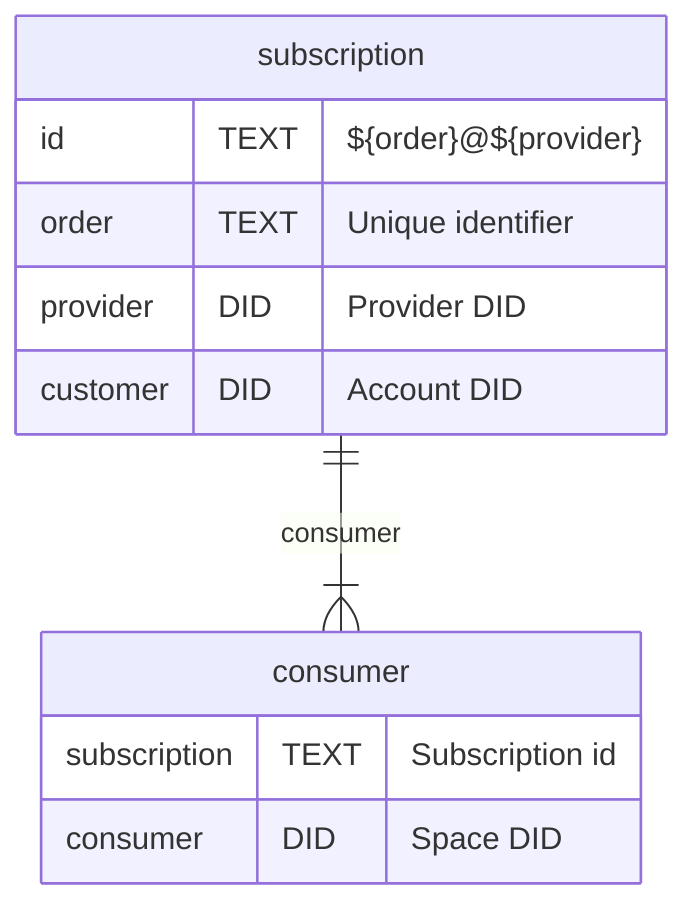

# Capabilities



> Perhaps we do not need two tables here ? iIt is 1:n relationship but what is the benefit over just adding `consumer` field to the `subscription` ?
>

## `access/authorize`

When invoked we can check the `subscription` table and insert a record like

```js
{
  provider: "did:web:web3.storage",
  customer: "did:mailto:web.mail:alice",
  order:    CBOR.link({ customer })
}
```


## `consumer/add`

Delegated by the provider to the account

```json
{
  "iss": "did:web:web3.storage",
  "aud": "did:mailto:web.mail:alice",
  "att": [{
    "with": "did:web:web3.storage",
    "can": "consumer/*",
    "nb": {
      "customer": "did:mailto:web.mail:alice",
      "order": "bafy...hash"
    }
  }]
}
```

This capability set allows invoker:

1. Insert into `subscription` table record where
  - `provider` is `with`
  - `customer` is `nb.customer`
  - `order` is `nb.order`

2. Insert into `consumer` table records where
- `subscription` is `${nb.order}@${with}`
- `consumer` is `*`

> Provider MAY want to enforce some constraints like limit the number of consumers but that is out of scope for now.

## `consumer/remove`

Delegated by the provider to the account

This capability allows invoker to delete records from the `consumer` table.


# Provider is in charge

Because provider is doing the delegation it can also invoke any of the capabilities and revoke capabilities it issued.


## `provider/get`

> Do we even need it ??

It is a way for to request a `consumer/*` capability delegation from the `provider`.

## `provider/add`

> Do we even need it ??

It is a way to request a `consumer/add` without having to do `provider/get` first. Because `provider` can invoke `consumer/add` this just short circuits.
