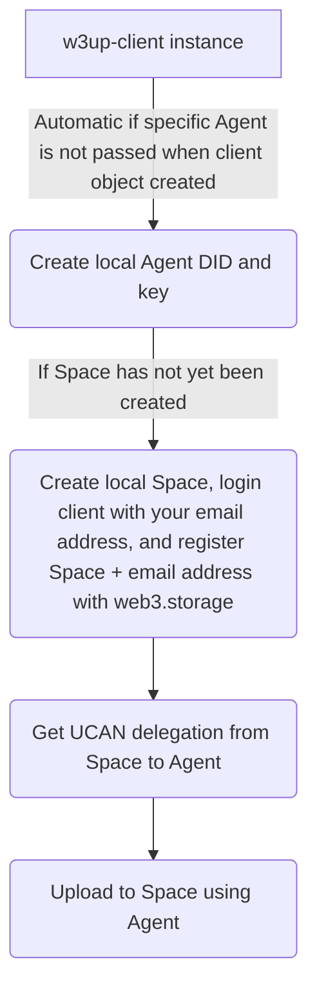
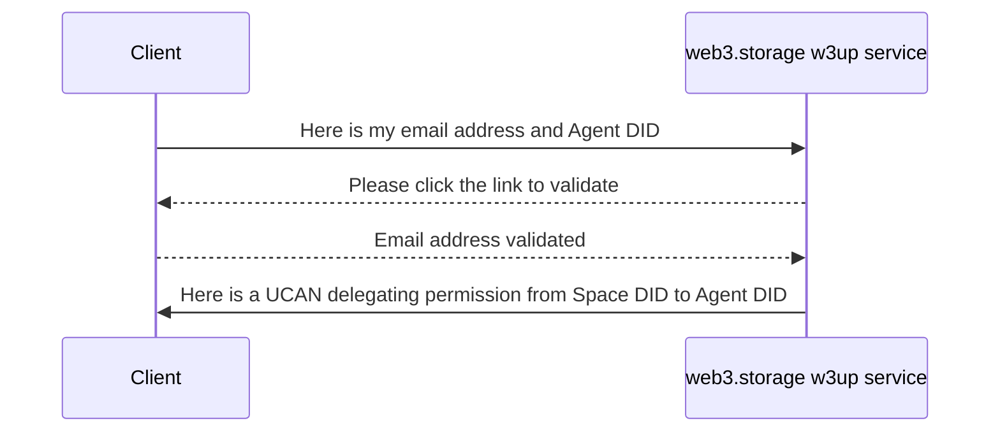
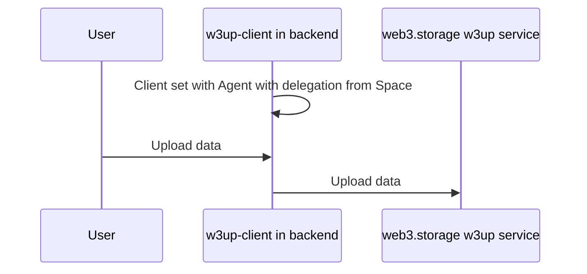
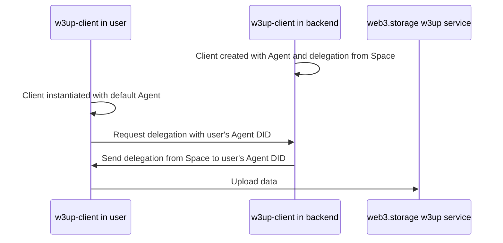
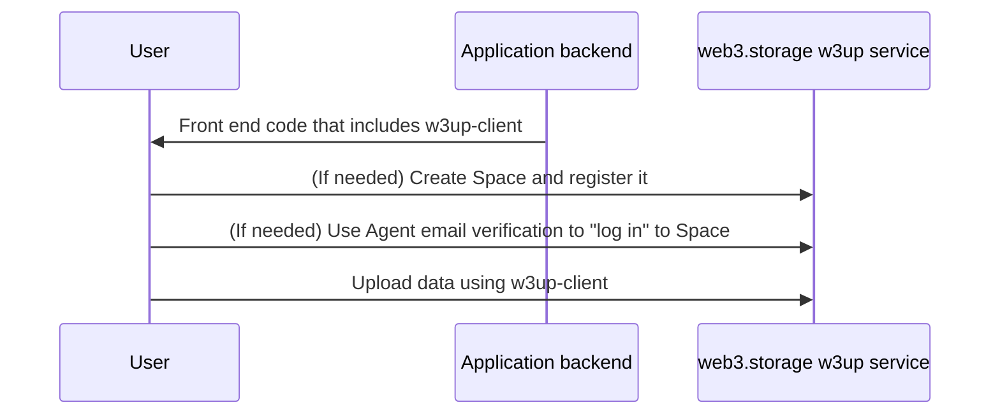

<h1 align="center"></h1>
<p align="center">The main JavaScript client for the w3up platform by <a href="https://web3.storage">https://web3.storage</a></p>
<p align="center">
  <a href="https://github.com/storacha/w3up/actions/workflows/w3up-client.yml"></a>
  <a href="https://discord.com/channels/806902334369824788/864892166470893588"></a>
  <a href="https://x.com/web3storage"></a>
  <a href="https://github.com/storacha/w3up/blob/main/packages/w3up-client/LICENSE.md"></a>
</p>

## About

`@web3-storage/w3up-client` is a JavaScript library that provides a convenient interface to the w3up platform, a simple "on-ramp" to the content-addressed decentralized IPFS network.

This library is the user-facing "porcelain" client for interacting with w3up services from JavaScript. It wraps the lower-level [`@web3-storage/access`][access-client-github] and [`@web3-storage/upload-client`][upload-client-github] client packages, which target individual w3up services. We recommend using `w3up-client` instead of using those "plumbing" packages directly, but you may find them useful if you need more context on w3up's architecture and internals.

**`w3up-client` requires modern browser or Node 18+**.

> ⚠️❗ __Public Data__ 🌎: All data uploaded to w3up is available to anyone who requests it using the correct CID. Do not store any private or sensitive information in an unencrypted form using w3up.

> ⚠️❗ __Permanent Data__ ♾️: Removing files from w3up will remove them from the file listing for your account, but that doesn’t prevent nodes on the decentralized storage network from retaining copies of the data indefinitely. Do not use w3up for data that may need to be permanently deleted in the future.

- [Install](#install)
- [Usage](#usage)
  - [How w3up and w3up-client use UCANs](#how-w3up-and-w3up-client-use-ucans)
    - [Space](#space)
    - [Agent](#agent)
  - [Basic usage with web3.storage](#basic-usage-with-web3-storage)
    - [Creating a client object](#creating-a-client-object)
    - [Creating and registering Spaces](#creating-and-registering-spaces)
    - [Delegating from Space to Agent](#delegating-from-space-to-agent)
      - [Bringing your own Agent and delegation](#bringing-your-own-agent-and-delegation)
    - [Uploading data](#uploading-data)
  - [Integration options](#integration-options)
    - [Client-server](#client-server)
    - [Delegated](#delegated)
    - [User owned](#user-owned)
  - [Environments requiring wasm import](#environments-requiring-wasm-imports)
- [API](#api)
- [Contributing](#contributing)
- [License](#license)

## Install

You can add the `@web3-storage/w3up-client` package to your JavaScript or TypeScript project with `npm`:

```sh
npm install @web3-storage/w3up-client
```

## Usage

[API Reference](#api)

Most users' usage of `w3up-client` will be for interacting with web3.storage, a hosted storage product that developed w3up for their upload APIs. However, any user that has an implementation of w3up ([specs](https://github.com/storacha/specs), [protocol](https://github.com/storacha/w3up)) can configure `w3up-client` for their usage.

For authorization, w3up services use [ucanto][ucanto], a Remote Procedure Call (RPC) framework built around [UCAN](https://ucan.xzy), or User Controlled Authorization Networks. UCANs are a powerful capability-based authorization system that allows fine-grained sharing of permissions through a process called _delegation_ on top of [public key cryptography](https://en.wikipedia.org/wiki/Public-key_cryptography). See our [intro to UCAN blog post](https://blog.web3.storage/posts/intro-to-ucan) for an overview of UCAN.

You can think about UCAN replacing bearer tokens in traditional APIs for authorization with w3up. Since any actor can be represented by a cryptographic keypair and permissions can be delegated to them, users can interact with w3up directly in cases where a developer might have needed to previously run additional back-end infrastructure to keep API keys secure. This can be extended even to have end users using applications integrated with w3up using their own keypair-based identity.

### How w3up and w3up-client use UCANs

`w3up-client` and `ucanto` take care of the details of UCANs for you, but a few of the underlying terms and concepts may "bubble up" to the surface of the API, so we'll cover the basics here. We'll also go over some terms that are specific to w3up that you might not have encountered elsewhere.

UCAN-based APIs are centered around _capabilities_, which are comprised of an _ability_ and a _resource_. Together, the ability and resource determine what action a client can perform and what objects in the system can be acted upon. When invoking a service method, a client will present a UCAN token that includes an ability and resource, along with _proofs_ that verify that they should be allowed to exercise the capability. The proof might be signed directly by the capability owner, or have a chain of signatures (_delegations_) where the actor invoking the capability has been verifiably delegated permission to do so.

#### Space

When you upload data to w3up, your uploads are linked to a unique _Space_ that acts as a "namespace" for the data you upload. Each Space corresponds to a _DID_, or [Decentralized Identity Document](https://www.w3.org/TR/did-core/). In web3.storage's implementation of w3up, these Space DIDs generally use the key DID method, of the form `did:key:publicKey` with a corresponding private signing key.

When creating a Space using `w3up-client`, it generates this private key and `did:key` for you locally. To use web3.storage, you then register a Space by associating it with your email address. From there, when invoking storage capabilities with web3.storage, the Space `did:key` is the "resource" portion of the capability, while the ability is an action like `blob/add` or `blob/remove`. (A Space registered with web3.storage is imperfectly analogous to an "account" with web3.storage.)

Under the hood in the email registration process, your Space delegates the capabilities needed to use w3up to your email address, and this delegation is stored by web3.storage. If you need access to your Space in the future from any device, web3.storage allows you to reclaim those capabilities the same way you would reset a password in other services - using an email verification process. This means you don't need to store or manage Space private keys to use w3up - just create a new space, register it with w3up and use it from as many devices as you like. More on this "sign in" process is detailed in the next section on Agents.

#### Agent

To invoke a capability like `blob/add` on a Space using `w3up-client`, the client must have an _Agent_. Like a Space, an Agent corresponds to a `did:key` whose private key is generated locally. An Agent is useful once `w3up-client` has a UCAN delegation where a registered Space(s) delegates the Agent its capabilities. (An imperfect analogy is Agent with login session.)

The first time `w3up-client` is instantiated on a device, it creates an Agent automatically. Alternatively, if you have your own Agent corresponding to a specific private key locally available, you can pass it to the client.

The delegation from a Space to your Agent that `w3up-client` needs can be passed either by verifying the email address the Space is registered to and claiming the UCAN delegation (`login(email)` then `capability.access.claim`) or directly if you have the UCAN delegation available locally (`addSpace(delegation)`).

### Basic usage with web3.storage



All uses of `w3up-client` to upload with web3.storage follow the flow above. This section shows the most basic way to use the client to start storing data. For more complex integration options, check out the [integration options][https://github.com/storacha/w3up/blob/main/packages/w3up-client/README.md#integration-options] docs. For reference, check out the [API reference docs][docs] or the source code of the [`w3cli` package][w3cli-github], which uses `w3up-client` throughout.

> By you or your users registering a w3up Space via email confirmation with [web3.storage](http://web3.storage), you agree to the [Terms of Service](https://web3.storage/docs/terms/). 

#### Creating a client object

The package provides a [static `create` function][docs-create] that returns a [`Client` object][docs-Client]. 

```js
import { create } from '@web3-storage/w3up-client'

const client = await create()
```

By default, clients will create a new [`Agent`][access-docs-Agent] and put it in a persistent local [`Store`](https://github.com/storacha/w3up/tree/main/packages/access-client) if it can't find an existing one to load (so the next time the client is initialized on the same device, it will use the same `Agent`).

`create` accepts an optional [`ClientFactoryOptions` object][docs-ClientFactoryOptions] that can be used configured to use a non-default persistent `Store`. See the [`@web3-storage/access` docs](https://github.com/storacha/w3up/tree/main/packages/access-client) for more about `Store` configuration. If you'd like to bring your own Agent, you can initialize the client with your own storage [Driver](https://github.com/storacha/w3up/blob/main/packages/w3up-client/README.md#driver). An example would be using `Signer` from the [ucanto][ucanto] package.

```js
import { create } from '@web3-storage/w3up-client'
import * as Signer from '@ucanto/principal/ed25519' // Agents on Node should use Ed25519 keys

const principal = Signer.parse(agentPrivateKey) // created by `npx ucan-key ed --json` in command line
const client = await create({ principal })
```

Once initialized, you can access the client's `Agent` with the [`agent` getter][docs-Client#agent].

##### Pre-built bundle

You can also import a pre-built bundle, which adds the exports from the client to a _global_ variable `w3up`:

```html
<!doctype html>
<script src="https://cdn.jsdelivr.net/npm/@web3-storage/w3up-client/browser.min.js"></script>
<script>
  async function main () {
    const client = await w3up.create()
    console.log(client.did())
  }
  main()
</script>
```

#### Creating and registering Spaces

A [`Space`][docs-Space] acts as a namespace for your uploads, and what your Agent will need a delegation from to store data with w3up. The first thing to do is login your Agent with your email address. Calling `login` will cause an email to be sent to the given address. Once a user clicks the confirmation link in the email, the `login` method will resolve. Make sure to check for errors, as `login` will fail if the email is not confirmed within the expiration timeout. Authorization needs to happen only once per agent.

```js
const account = await client.login('zaphod@beeblebrox.galaxy')
```

If your account doesn't have a payment plan yet, you'll be prompted to select one after verifying your email. A payment plan is required to provision a space. You can use the following loop to wait until a payment plan is selected:

```js
// Wait for a payment plan with a 1-second polling interval and 15-minute timeout
await account.plan.wait()
```

Spaces can be created using the [`createSpace` client method][docs-client#createSpace]:

```js
const space = await client.createSpace('my-awesome-space', { account })
```

Alternatively, you can use the w3cli command [`w3 space create`](https://github.com/storacha/w3cli#w3-space-create-name).

The `name` parameter is optional. If provided, it will be stored in your client's local state store and can be used to provide a friendly name for user interfaces.

If an `account` is provided in the options, a delegated recovery account is automatically created and provisioned, allowing you to store data and delegate access to the recovery account. This means you can access your space from other devices, as long as you have access to your account.

If this is your Agent's first space, it will automatically be set as the "current space." If you already have spaces and want to set the new one as current, you can do so manually:

```js
await client.setCurrentSpace(space.did())
```

ℹ️ Note: If you do not create the space passing the account parameter you run the risk of losing access to your space!

#### Delegating from Space to Agent

In order to store data with w3up, your Agent will need a delegation from a Space. This automatically happens if you called `createSpace`. However, if you are initializing the client with a previously created Space, you can `login(email)` then claim a delegation granted to the account associated with your email:

```js
await client.login('zaphod@beeblebrox.galaxy')
await client.setCurrentSpace(space.did()) # select the relevant Space DID that is associated with your account
```



##### Bringing your own Agent and delegation

For uses of `w3up-client` in environments where the Agent is not persisted and/or the email verification step would be prohibitive (e.g., serverless backend environment where local Store with the Agent is dropped in between runs, and going through the email verification flow isn't practical), you can manually add a delegation for access to a Space created by a different authorized agent (see the [`addSpace` client method](docs-client#addSpace)). An example (where [w3cli](https://github.com/storacha/w3cli) is set up with the Space that we want to delegate permissions from in our client instance):

```js
import * as Signer from '@ucanto/principal/ed25519' // Agents on Node should use Ed25519 keys
import { importDAG } from '@ucanto/core/delegation'
import { CarReader } from '@ipld/car'
import * as Client from '@web3-storage/w3up-client'
import { StoreMemory } from '@web3-storage/w3up-client/stores/memory'

async function main () {
  // from "bring your own Agent" example in `Creating a client object" section`
  // used command line to generate KEY and PROOF (stored in env variables)
  // KEY: `npx ucan-key ed --json` in command line, which returns private key and DID for Agent (the private key is stored in KEY)
  // PROOF: w3cli used to run `w3 delegation create <did_from_ucan-key_command_above> --can 'blob/add' --can 'index/add' --can 'filecoin/offer' --can 'upload/add' | base64`, which returns the delegation from Space to the Agent we're using (stored in PROOF)
  const principal = Signer.parse(process.env.KEY)
  const store = new StoreMemory()
  const client = await Client.create({ principal, store })
  
  // now give Agent the delegation from the Space
  const proof = await parseProof(process.env.PROOF)
  const space = await client.addSpace(proof)
  await client.setCurrentSpace(space.did())
  
  // READY to go!
}

/** @param {string} data Base64 encoded CAR file */
async function parseProof (data) {
  const blocks = []
  const reader = await CarReader.fromBytes(Buffer.from(data, 'base64'))
  for await (const block of reader.blocks()) {
    blocks.push(block)
  }
  return importDAG(blocks)
}
```

#### Uploading data

Once you've [created and registered a Space](#creating-and-registering-spaces) and [authorized your Agent](#authorizing-your-agent), you can upload files to the w3up platform.

Call [`uploadFile`][docs-Client#uploadFile] to upload a single file, or [`uploadDirectory`][docs-Client#uploadDirectory] to upload multiple files.

`uploadFile` expects a "Blob like" input, which can be a [`Blob`](https://developer.mozilla.org/en-US/docs/Web/API/Blob) or [`File`](https://developer.mozilla.org/en-US/docs/Web/API/File) when running in a browser. On node.js, see the [`filesFromPath` library](https://github.com/storacha/files-from-path), which can load compatible objects from the local filesystem.

`uploadDirectory` requires `File`-like objects instead of `Blob`s, as the file's `name` property is used to build the directory hierarchy. 

You can control the directory layout and create nested directory structures by using `/` delimited paths in your filenames:

```js
const files = [
  new File(['some-file-content'], 'readme.md'),
  new File(['import foo'], 'src/main.py'),
  new File([someBinaryData], 'images/example.png'),
]

const directoryCid = await client.uploadDirectory(files)
```

In the example above, `directoryCid` resolves to an IPFS directory with the following layout:

```
.
├── images
│   └── example.png
├── readme.md
└── src
    └── main.py
```


### Integration options

As mentioned, UCAN opens up a number of options in how to integrate with w3up: Should you, the developer, own the Space? Should you delegate permissions to your users? Or should your user own their own Space? Broadly, there are three ways to integrate:
- (Simplest) Client-server: You (the developer) own the Space, and your user uploads to your backend infra before you upload it to the service
- (More complex) Delegated: You own the Space, but you give a delegated UCAN token to your user's Agent to upload directly to the service (rather than needing to touch the upload in your backend)
- (Most complex) User-owned: Your user owns the Space and registers it and they use it to upload directly with the service; if you want to instrument visibility into what they’re uploading, you’ll have to write separate code in your app for it

You can implement each of these in a number of ways, but we talk through some considerations when implementing a given option.

#### Client-server

- For your backend to be scalable, you might consider using serverless workers or a queue in front of a server
- In either case, you'll need a registered Space, and your client instance in your backend to have an Agent with a delegation from this Space
  - (Recommended) It's likely easiest to create and register your Space using [w3cli](https://github.com/storacha/w3cli) rather than using `w3up-client` to do so (especially if your backend isn't persistent); you can then generate your own Agent and delegate the ability to upload to your Space using something like [this example](#bringing-your-own-agent-and-delegation)
  - If your backend is persistent, you can do this or do everything in the client directly ([create Space](#creating-and-registering-spaces) and [get delegation](#delegating-from-space-to-agent))
- After this, once your user uploads data to your backend, you can run any of the `upload` methods

#### Delegated

- You will likely have `w3up-client` running in your end-user's client code, as well as backend code that's able to generate UCANs that delegate the ability to upload and pass them to your users (e.g., `w3up-client` running in a serverless worker)
- For your backend to be scalable, you might consider using serverless workers or a queue in front of a server
- As the developer, you'll need a registered Space, and your client instance in your backend to have an Agent with a delegation from this Space
    - (Recommended) It's likely easiest to create and register your Space using [w3cli](https://github.com/storacha/w3cli) rather than using `w3up-client` to do so (especially if your backend isn't persistent); you can then generate your own Agent and delegate the ability to upload to your Space using something like [this example](#bringing-your-own-agent-and-delegation)
  - If your backend is persistent, you can do this or do everything in the client directly ([create Space](#creating-and-registering-spaces) and [get delegation](#delegating-from-space-to-agent))
- Your user does not need a registered Space - just an Agent with a delegation from your Space
  - `w3up-client` in the end user environment should have a unique Agent for each user, which should happen by default (since when `w3up-client` is instantiated it creates a new Agent anyway, or uses the one in local Store)
  - From there, when your end user is ready to upload, they should request from your backend a delegation from your developer-owned Space to their Agent (which can be derived via [`client.agent`](docs-Client#agent))
    - In your backend, you can call [`client.createDelegation()`](docs-Client#createDelegation) passing in the Agent object from `client.agent()` in your end user's instance, and passing through `options?` params to limit the scope of the delegation (e.g., `blob/add`, `upload/add`, expiration time)
    - You can serialize this using `delegation.archive()` and send it to your user
    - The end user instance of the client should not need to call `client.login(email)`, as it is not claiming any delegations via email address (but rather getting the delegation directly from your backend)
- Once your user receives the delegation, they can deserialize it using [`ucanto.Delegation.extract()`](https://github.com/storacha/ucanto/blob/c8999a59852b61549d163532a83bac62290b629d/packages/core/src/delegation.js#L399) and pass it in using `client.addSpace()`, and from there they can run any of the `upload` methods
    - Note that this alone does not give visibility into which of your end users are uploading what; to track this, you'll probably need them to send you that information separately (e.g., once they've run `upload` and get back a content CID, you can have them send that CID to you for tracking)
- A code example that does this can be found below

```js
import { CarReader } from '@ipld/car';
import * as DID from '@ipld/dag-ucan/did';
import * as Delegation from '@ucanto/core/delegation';
import { importDAG } from '@ucanto/core/delegation';
import * as Signer from '@ucanto/principal/ed25519';
import * as Client from '@web3-storage/w3up-client';

async function backend(did: string) {
  // Load client with specific private key
  const principal = Signer.parse(process.env.KEY);
  const client = await Client.create({ principal });

  // Add proof that this agent has been delegated capabilities on the space
  const proof = await parseProof(process.env.PROOF);
  const space = await client.addSpace(proof);
  await client.setCurrentSpace(space.did());

  // Create a delegation for a specific DID
  const audience = DID.parse(did);
  const abilities = ['blob/add', 'index/add', 'filecoin/offer', 'upload/add'];
  const expiration = Math.floor(Date.now() / 1000) + 60 * 60 * 24; // 24 hours from now
  const delegation = await client.createDelegation(audience, abilities, {
    expiration,
  });

  // Serialize the delegation and send it to the client
  const archive = await delegation.archive();
  return archive.ok;
}

/** @param {string} data Base64 encoded CAR file */
async function parseProof(data) {
  const blocks = [];
  const reader = await CarReader.fromBytes(Buffer.from(data, 'base64'));
  for await (const block of reader.blocks()) {
    blocks.push(block);
  }
  return importDAG(blocks);
}

async function frontend() {
  // Create a new client
  const client = await Client.create();

  // Fetch the delegation from the backend
  const apiUrl = `/api/w3up-delegation/${client.agent().did()}`;
  const response = await fetch(apiUrl);
  const data = await response.arrayBuffer();

  // Deserialize the delegation
  const delegation = await Delegation.extract(new Uint8Array(data));
  if (!delegation.ok) {
    throw new Error('Failed to extract delegation');
  }

  // Add proof that this agent has been delegated capabilities on the space
  const space = await client.addSpace(delegation.ok);
  client.setCurrentSpace(space.did());

  // READY to go!
}
```

#### User-owned

- If you want your user to own their own Space, you'll likely be relying on the `w3up-client` methods to create a Space, authorize the Space, and authorize the Agent on the end user-side; from there they can run any of the `upload` methods
    - Doing this does take some of the UX out of your control; for instance, when web3.storage fully launches with w3up, your users will have to set up their payment methods with web3.storage
    - Note that this alone does not give visibility into which of your end users are uploading what; to track this, you'll probably need them to send you that information separately (e.g., once they've run `upload` and get back a content CID, you can have them send that CID to you for tracking)
- There is a world of possibilities with your users "bringing their own identity" for their Space; you could explore how crypto wallet private keys, Apple Passkey, and more might map to Space DIDs and have the client use those
- If you have code snippet(s) that works for you, please share them in a PR or [Github issue](https://github.com/storacha/w3up/issues) and we'll link them here!

### Environments requiring wasm import

Some environments (for instance Cloudflare Workers) require wasm bytecode to be imported. All other paths to load wasmm are disallowed by embedder. For these use cases, the default export of `w3up-client` (most compatible) won't work out of the box. A custom build will need to be created to get the client working.

We created a `esbuild-plugin` [esbuild-plugin-w3up-client-wasm-import](https://github.com/vasco-santos/esbuild-plugin-w3up-client-wasm-import) that you can easily use. There is also an [example repository](https://github.com/vasco-santos/worker-w3up-client-example).

## API

- [`create`](#create)
- `Client`
  - [`uploadDirectory`](#uploaddirectory)
  - [`uploadFile`](#uploadfile)
  - [`uploadCAR`](#uploadcar)
  - [`agent`](#agent)
  - [`login`](#login)
  - [`accounts`](#accounts)
  - [`currentSpace`](#currentspace)
  - [`setCurrentSpace`](#setcurrentspace)
  - [`spaces`](#spaces)
  - [`createSpace`](#createspace)
  - [`addSpace`](#addSpace)
  - [`proofs`](#proofs)
  - [`addProof`](#addproof)
  - [`delegations`](#delegations)
  - [`createDelegation`](#createdelegation)
  - [`remove`](#remove)
  - [`capability.access.authorize`](#capabilityaccessauthorize)
  - [`capability.access.claim`](#capabilityaccessclaim)
  - [`capability.blob.add`](#capabilityblobadd)
  - [`capability.blob.list`](#capabilitybloblist)
  - [`capability.blob.remove`](#capabilityblobremove)
  - [`capability.index.add`](#capabilityindexadd)
  - [`capability.plan.get`](#capabilityplanget)
  - [`capability.plan.set`](#capabilityplanset)
  - [`capability.plan.createAdminSession`](#capabilityplancreateadminsession)    
  - [`capability.space.info`](#capabilityspaceinfo)
  - [`capability.upload.add`](#capabilityuploadadd)
  - [`capability.upload.list`](#capabilityuploadlist)
  - [`capability.upload.remove`](#capabilityuploadremove)
  - [`capability.filecoin.offer`](#capabilityfilecoinoffer)
  - [`capability.filecoin.info`](#capabilityfilecoininfo)
- [Types](#types)
  - [`BlobListResult`](#bloblistresult)
  - [`Capability`](#capability)
  - [`CARMetadata`](#carmetadata)
  - [`ClientFactoryOptions`](#clientfactoryoptions)
  - [`Delegation`](#delegation)
  - [`Driver`](#driver)
  - [`ListResponse`](#listresponse)
  - [`ServiceConf`](#serviceconf)
  - [`ShardStoredCallback`](#shardstoredcallback)
  - [`Space`](#space)
  - [`UploadListResult`](#uploadlistresult)

---

### `create`

```ts
function create (options?: ClientFactoryOptions): Promise<Client>
```

Create a new w3up client.

If no backing store is passed one will be created that is appropriate for the environment.

If the backing store is empty, a new signing key will be generated and persisted to the store. In the browser an unextractable RSA key will be generated by default. In other environments an Ed25519 key is generated.

If the backing store already has data stored, it will be loaded and used.

More information: [`ClientFactoryOptions`](#clientfactoryoptions)

### `uploadDirectory`

```ts
function uploadDirectory (
  files: File[],
  options: {
    retries?: number
    signal?: AbortSignal
    onShardStored?: ShardStoredCallback
    shardSize?: number
    concurrentRequests?: number
  } = {}
): Promise<CID>
```

Uploads a directory of files to the service and returns the root data CID for the generated DAG. All files are added to a container directory, with paths in file names preserved.

More information: [`ShardStoredCallback`](#shardstoredcallback)

### `uploadFile`

```ts
function uploadFile (
  file: Blob,
  options: {
    retries?: number
    signal?: AbortSignal
    onShardStored?: ShardStoredCallback
    shardSize?: number
    concurrentRequests?: number
  } = {}
): Promise<CID>
```

Uploads a file to the service and returns the root data CID for the generated DAG.

More information: [`ShardStoredCallback`](#shardstoredcallback)

### `uploadCAR`

```ts
function uploadCAR (
  car: Blob,
  options: {
    retries?: number
    signal?: AbortSignal
    onShardStored?: ShardStoredCallback
    shardSize?: number
    concurrentRequests?: number
    rootCID?: CID
  } = {}
): Promise<CID>
```

Uploads a CAR file to the service. The difference between this function and [capability.store.add](#capabilitystoreadd) is that the CAR file is automatically sharded and an "upload" is registered (see [`capability.upload.add`](#capabilityuploadadd)), linking the individual shards. Use the `onShardStored` callback to obtain the CIDs of the CAR file shards.

More information: [`ShardStoredCallback`](#shardstoredcallback)

### `agent`

```ts
function agent (): Signer
```

The user agent. The agent is a signer - an entity that can sign UCANs with keys from a `Principal` using a signing algorithm.

### `authorize`

```ts
function authorize (email: string, options?: { signal?: AbortSignal }): Promise<void>
```

Authorize the current agent to use capabilities granted to the passed email account.

### `accounts`

```ts
function accounts (): Record<DID, Account>
```

List all accounts the agent has stored access to.

### `currentSpace`

```ts
function currentSpace (): Space|undefined
```

The current space in use by the agent.

### `setCurrentSpace`

```ts
function setCurrentSpace (did: DID): Promise<void>
```

Use a specific space.

### `spaces`

```ts
function spaces (): Space[]
```

Spaces available to this agent.

### `createSpace`

```ts
async function createSpace(name?: string, options?: {account: Account}): Promise<Space>
```

Create a new space with an optional name.

### `addSpace`

```ts
async function addSpace (proof: Delegation): Promise<Space>
```

Add a space from a received proof. Proofs are delegations with an _audience_ matching the agent DID.

### `proofs`

```ts
function proofs (capabilities?: Capability[]): Delegation[]
```

Get all the proofs matching the capabilities. Proofs are delegations with an _audience_ matching the agent DID.

### `addProof`

```ts
function addProof (proof: Delegation): Promise<void>
```

Add a proof to the agent. Proofs are delegations with an _audience_ matching the agent DID. Note: `addSpace` should be used for delegating from `Space` to `Agent` (i.e., you want the Agent to fully be able to act on behalf of the Space), as it calls `addProof` with some additional client logic. `addProof` is for more generically adding delegations to the Agent (e.g., delegation targets a resource _other_ than a Space).

### `delegations`

```ts
function delegations (capabilities?: Capability[]): Delegation[]
```

Get delegations created by the agent for others. Filtered optionally by capability.

### `createDelegation`

```ts
function createDelegation (
  audience: Principal,
  abilities: string[],
  options?: UCANOptions
): Promise<Delegation>
```

Create a delegation to the passed audience for the given abilities with the _current_ space as the resource.

### `remove`

```ts
function remove (
  contentCID?: CID
  options: {
    shards?: boolean
  } = {}
): Promise<void>
```

Removes association of a content CID with the space. Optionally, also removes association of CAR shards with space.

⚠️ If `shards` option is `true` all shards will be deleted even if there is another upload(s) that reference same shards, which in turn could corrupt those uploads.

### `getReceipt`

```ts
function getReceipt (
  taskCid: CID
): Promise<Receipt>
```

Get a receipt for an executed task by its CID.

### `capability.access.authorize`

```ts
function authorize (
  email: string,
  options: { signal?: AbortSignal } = {}
): Promise<void>
```

Authorize the current agent to use capabilities granted to the passed email account.

### `capability.access.claim`

```ts
function claim (): Promise<Delegation<Capabilities>[]>
```

Claim delegations granted to the account associated with this agent. Note: the received delegations are added to the agent's persistent store.

### `capability.blob.add`

```ts
function add (
  blob: Blob,
  options: { retries?: number; signal?: AbortSignal } = {}
): Promise<MultihashDigest>
```

Store a blob to the service.

### `capability.blob.list`

```ts
function list (
  options: { retries?: number; signal?: AbortSignal } = {}
): Promise<ListResponse<BlobListResult>>
```

List blobs stored in the current space.

More information: [`BlobListResult`](#bloblistresult), [`ListResponse`](#listresponse)

### `capability.blob.remove`

```ts
function remove (
  digest: MultihashDigest,
  options: { retries?: number; signal?: AbortSignal } = {}
): Promise<void>
```

Remove a stored blob by multihash digest.

### `capability.index.add`

```ts
function add(
  index: CID,
  options: { retries?: number; signal?: AbortSignal } = {}
): Promise<IndexAddResponse>
```

Register an "index" with the service. The `index` CID should be the CID of a CAR file, containing an index ad defined by [w3-index](https://github.com/storacha/specs/blob/main/w3-index.md).

Required delegated capability proofs: `index/add`

### `capability.plan.get`

```ts
function get (
  account: AccountDID
): Promise<PlanGetSuccess>
```

Get information about an account's billing plan.

### `capability.plan.set`

```ts
function set (
  account: AccountDID,
  product: DID
): Promise<{}>
```

Switch an account's "plan" to the given product. **This may result in
changes to your billing or unexpected billing cycles depending on the
type of change.**

### `capability.plan.createAdminSession`

```ts
function createAdminSession (
  account: AccountDID,
  returnURL: string
): Promise<{url: string}>
```

Create a billing customer portal admin session. Returns a URL that 
the customer can visit to administer `account`. Design and implementation driven 
by our Stripe integration and may not be supported by all billing providers.

### `capability.upload.add`

```ts
function add (
  root: CID,
  shards: CID[],
  options: { retries?: number; signal?: AbortSignal } = {}
): Promise<UploadAddResponse>
```

Register a set of stored CAR files as an "upload" in the system. A DAG can be split between multiple CAR files. Calling this function allows multiple stored CAR files to be considered as a single upload.

### `capability.upload.list`

```ts
function list(
  options: { retries?: number; signal?: AbortSignal } = {}
): Promise<ListResponse<UploadListResult>>
```

List uploads created in the current space.

More information: [`UploadListResult`](#uploadlistresult), [`ListResponse`](#listresponse)

### `capability.upload.remove`

```ts
function remove(
  link: CID,
  options: { retries?: number; signal?: AbortSignal } = {}
): Promise<void>
```

Remove a upload by root data CID.

### `capability.filecoin.offer`

```ts
function offer (
  content: CID,
  piece: PieceLink,
): Promise<FilecoinOfferResponse>
```

Offer a Filecoin "piece" to be added to an aggregate that will be offered for Filecoin deal(s).

### `capability.filecoin.info`

```ts
function info (
  piece: PieceLink
): Promise<FilecoinInfoResponse>
```

Get know deals and aggregate info of a Filecoin "piece" previously offered.

## Types

### `BlobListResult`

```ts
interface BlobListResult {
  blob: {
    digest: Uint8Array
    size: number
  }
}
```

### `Capability`

An object describing a UCAN capability, which specifies what action the UCAN holder `can` perform `with` some resource.

Defined by the [`@ipld/dag-ucan` package](https://github.com/ipld/js-dag-ucan).

```ts
export interface Capability<
  Can extends Ability = Ability,
  With extends Resource = Resource,
  Caveats extends unknown = unknown
> {
  with: With
  can: Can
  nb?: Caveats
}

export type Ability = `${string}/${string}` | "*"

export type Resource = `${string}:${string}`
```

The `can` field contains a string ability identifier, e.g. `blob/add` or `space/info`.

The `with` field contains a resource URI, often a `did:key` URI that identifies a Space.

The optional `nb` (_nota bene_) field contains "caveats" that add supplemental information to a UCAN invocation or delegation.

See [the `@web3-storage/capabilities` package](https://github.com/storacha/w3up/tree/main/packages/capabilities) for more information about capabilities and how they are defined in w3up services.

### `CARMetadata`

Metadata pertaining to a CAR file.

```ts
export interface CARMetadata {
  /**
   * CAR version number.
   */
  version: number
  /**
   * Root CIDs present in the CAR header.
   */
  roots: CID[]
  /**
   * CID of the CAR file (not the data it contains).
   */
  cid: CID
  /**
   * Size of the CAR file in bytes.
   */
  size: number
}
```

### `Delegation`

An in-memory view of a UCAN delegation, including proofs that can be used to invoke capabilities or delegate to other agents.

```ts
import { Delegation as CoreDelegation } from '@ucanto/core/delegation'
export interface Delegation extends CoreDelegation {
  /**
   * User defined delegation metadata.
   */
  meta(): Record<string, any>
} 
```

The `Delegation` type in `w3up-client` extends the `Delegation` type defined by [`ucanto`][ucanto]:

```ts
export interface Delegation<C extends Capabilities = Capabilities> {
  readonly root: UCANBlock<C>
  readonly blocks: Map<string, Block>

  readonly cid: UCANLink<C>
  readonly bytes: ByteView<UCAN.UCAN<C>>
  readonly data: UCAN.View<C>

  asCID: UCANLink<C>

  export(): IterableIterator<Block>

  issuer: UCAN.Principal
  audience: UCAN.Principal
  capabilities: C
  expiration?: UCAN.UTCUnixTimestamp
  notBefore?: UCAN.UTCUnixTimestamp

  nonce?: UCAN.Nonce

  facts: Fact[]
  proofs: Proof[]
  iterate(): IterableIterator<Delegation>
}
```

Delegations can be serialized by calling `export()` and piping the returned `Block` iterator into a `CarWriter` from the [`@ipld/car` package](https://www.npmjs.com/package/@ipld/car).

### `Driver`

Storage drivers can be obtained from [`@web3-storage/access/stores`](https://github.com/storacha/w3up/tree/main/packages/access-client). They persist data created and managed by an agent.

### `ListResponse`

A paginated list of items.

```ts
interface ListResponse<R> {
  cursor?: string
  size: number
  results: R[]
}
```

### `ServiceConf`

Service DID and URL configuration.

### `ShardStoredCallback`

A function called after a DAG shard has been successfully stored by the service:

```ts
type ShardStoredCallback = (meta: CARMetadata) => void
```

More information: [`CARMetadata`](#carmetadata)

### `Space`

An object representing a storage location. Spaces must be [registered](#registerspace) with the service before they can be used for storage.

```ts
interface Space {
  
  /**
   * The given space name.
   */  
  name(): string
  
  /**
   * The DID of the space.
   */  
  did(): string
  
  /**
   * Whether the space has been registered with the service.
   */  
  registered(): boolean
  
  
  /**
   * User defined space metadata.
   */  
  meta(): Record<string, any>
}
```

### `UploadListResult`

```ts
interface UploadListResult {
  root: CID
  shards?: CID[]
}
```

## Contributing

Feel free to join in. All welcome. Please [open an issue](https://github.com/storacha/w3up/issues)!

## License

Dual-licensed under [MIT + Apache 2.0](https://github.com/storacha/w3up/blob/main/packages/w3up-client/LICENSE.md)

[w3cli-github]: https://github.com/storacha/w3cli
[access-client-github]: https://github.com/storacha/w3up/tree/main/packages/access-client
[upload-client-github]: https://github.com/storacha/w3up/tree/main/packages/upload-client
[elastic-ipfs]: https://github.com/elastic-ipfs/elastic-ipfs
[ucanto]: https://github.com/storacha/ucanto
[car-spec]: https://ipld.io/specs/transport/car/
[web3storage-docs-cars]: https://web3.storage/docs/concepts/car/

[docs]: https://web3-storage.github.io/w3up/modules/_web3_storage_w3up_client.html
[docs-Client]: https://web3-storage.github.io/w3up/classes/_web3_storage_w3up_client.Client.html
[docs-Client#agent]: https://web3-storage.github.io/w3up/classes/_web3_storage_w3up_client.Client.html#agent
[docs-Client#createDelegation]: https://web3-storage.github.io/w3up/classes/_web3_storage_w3up_client.Client.html#createDelegation
[docs-Client#createSpace]: https://web3-storage.github.io/w3up/classes/_web3_storage_w3up_client.Client.html#createSpace
[docs-Client#setCurrentSpace]: https://web3-storage.github.io/w3up/classes/_web3_storage_w3up_client.Client.html#setCurrentSpace
[docs-Client#uploadFile]: https://web3-storage.github.io/w3up/classes/_web3_storage_w3up_client.Client.html#uploadFile
[docs-Client#uploadDirectory]: https://web3-storage.github.io/w3up/classes/_web3_storage_w3up_client.Client.html#uploadDirectory
[docs-Space]: https://web3-storage.github.io/w3up/modules/_web3_storage_access.Space.html

[docs-create]: #create
[docs-ClientFactoryOptions]: https://web3-storage.github.io/w3up/interfaces/_web3_storage_w3up_client.unknown.ClientFactoryOptions.html

[access-docs-Agent]: https://web3-storage.github.io/w3up/classes/_web3_storage_access.Agent.html
