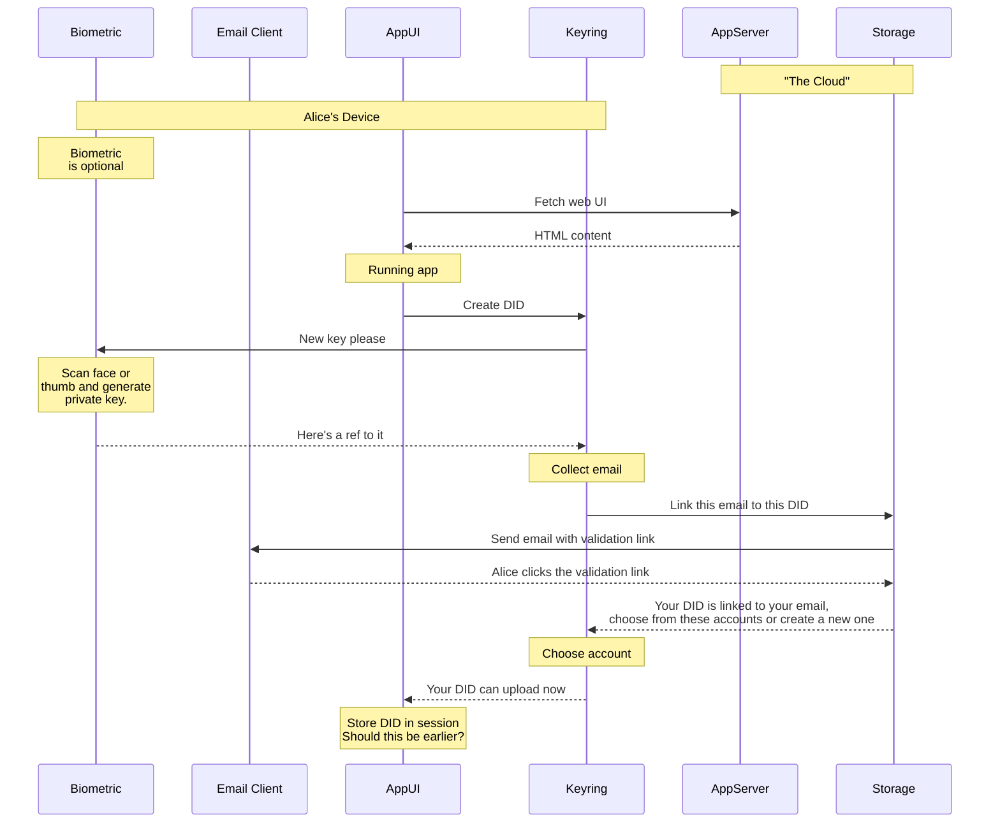
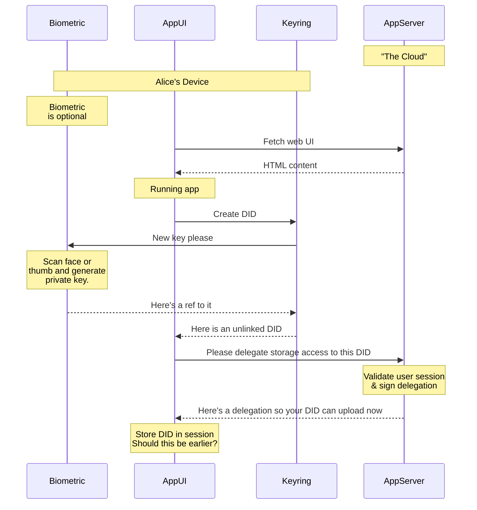

Regisitration is different depending on whether the app implements user-pays or app-pays storage payment models.

# Payment models

The two basic models are **user pays** and **app pays**. One is low-commitment for the developer, the other is invisible to the user. More nuanced hybrid models are also possible.

## User pays (transparent to developer)

In the default case, when a developer adds w3ui components to their application, the user is prompted to create a new (or link to an existing) account with web3.storage, where uploads are stored. When the user exceeds free plan usage, they will be prompted to provide a payment method.

### Registration on first run (user pays)

> The word "account" in the "Choose account" box is confusing. Since your billing account (email-level grouping) can have very many of these (roughly one per app). And your keyring identity can have access to these namespaces without paying for them. So maybe we call them "buckets" or "containers" or "apps" or "namespaces". Maybe they are the same thing we give w3names to? --- @jchris 

## App pays (transparent to user)

This assumes the App Server has already established a Storage account, and has access to private key signing capabilities (perhaps via an embedded web3.storage keyring). The servers's account will delegate access to user DIDs.

### Registration on first run (app pays)

> It might make sense to detail out the AppServer interactions with the AppServer Keyring. Currently the details on the app server delegation are elided.

