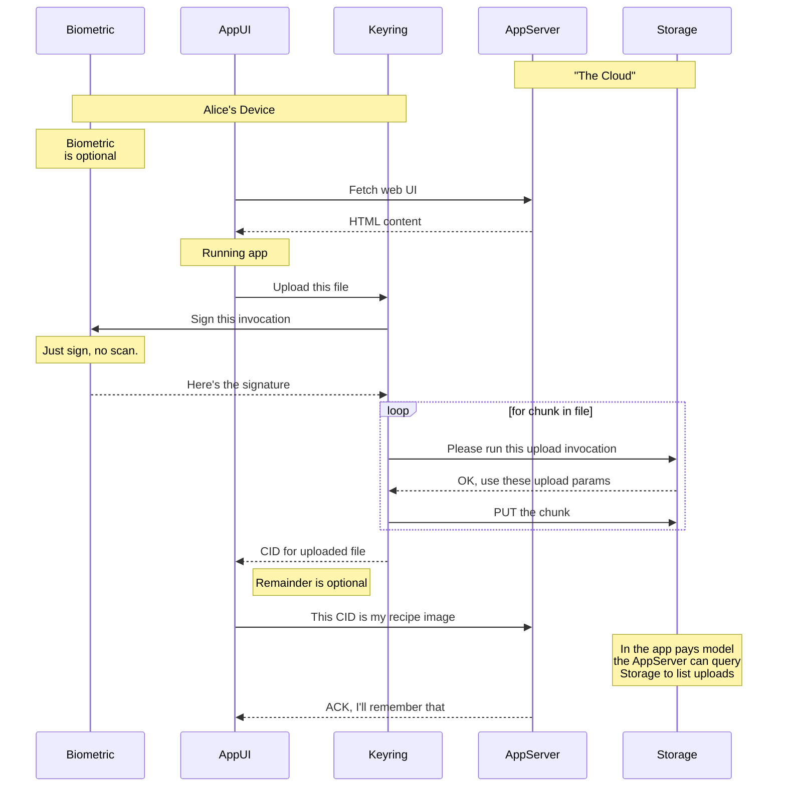
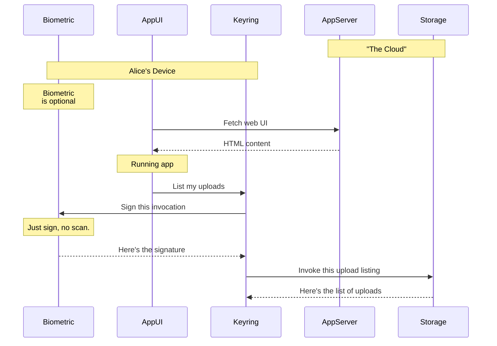

Upload and list are basically the same regardless of which payment model is used.

## Same flow whether app or user pays

Once the AppUI has established a valid delegation for uploading, the upload logic proceeds the same no matter which payment model is in use.

> In the below it starts to seem like maybe instead of Keyring we should be talking about w3up client... @jchris

### Upload with valid delegation

This will be the same both when the user pays, and in the case where the user's DID has a valid delegation allowing it to upload to the app's account.

Note that in the server-pays model there will be other ways for the server to query user-saved data, so the user may not need to tell the server about their uploaded CID directly.

### List uploads with valid delegation

